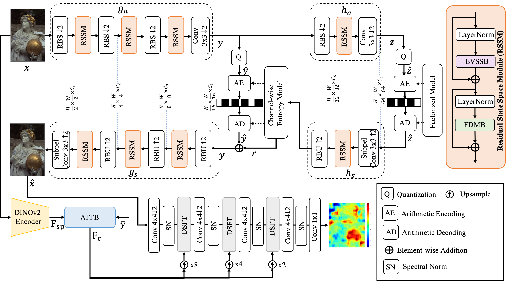
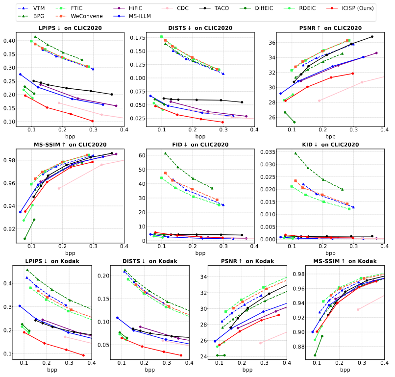

# A Lightweight Model for Perceptual Image Compression via Implicit Priors

[Hao Wei](https://scholar.google.com.hk/citations?user=hhNFVW0AAAAJ&hl=zh-CN), Yanhui Zhou, Yiwen Jia, Chenyang Ge, [Saeed Anwar](https://scholar.google.com.hk/citations?user=vPJIHywAAAAJ&hl=zh-CN), [Ajmal Mian](https://scholar.google.com.hk/citations?user=X589yaIAAAAJ&hl=zh-CN).

#### 🔥🔥🔥 News

- **2025-10-29:** The paper is accepted by Neural Networks.
- **2025-10-09:** This repo is released.

---
> **Abstract:** Perceptual image compression has shown strong potential for producing visually appealing results at low bitrates, surpassing classical standards and pixel-wise distortion-oriented neural methods.
However, existing methods typically improve compression performance by incorporating explicit semantic priors, such as segmentation maps and textual features, into the encoder or decoder, which increases model complexity by adding parameters and floating-point operations. This limits the model's practicality, as image compression often occurs on resource-limited mobile devices.
To alleviate this problem, we propose a lightweight perceptual **I**mage **C**ompression method using **I**mplicit **S**emantic **P**riors (**ICISP**). 
We first develop an enhanced visual state space block that exploits local and global spatial dependencies to reduce redundancy. 
Since different frequency information contributes unequally to compression, we develop a frequency decomposition modulation block to adaptively preserve or reduce the low-frequency and high-frequency information.
We establish the above blocks as the main modules of the encoder-decoder, and to further improve the perceptual quality of the reconstructed images, 
we develop a semantic-informed discriminator that uses implicit semantic priors from a pretrained DINOv2 encoder. 
Experiments on popular benchmarks show that our method achieves competitive compression performance and has significantly fewer network parameters and floating point operations than the existing state-of-the-art.
We will release the code and trained models.
---
>**Architecture:** We propose a lightweight model for image compression based on implicit semantic priors without adding extra parameters to the encoder or the decoder.
<center>

</center>

## ⚒️ TODO

* [x] Release code
* [ ] Upload the latest paper to Arxiv

## 🔗 Contents

- [x] [Datasets](#Datasets)
- [x] [Installation](#Installation) 
- [x] [Models](#Models)
- [x] [Train and Test](#TrainAndTest)
- [x] [Results](#Results)
- [x] [Citation](#Citation)
- [x] [Acknowledgements](#Acknowledgements)

## <a name="datasets"></a>📊 Datasets
We train the ICISP on the [LSDIR](https://ofsoundof.github.io/lsdir-data/) dataset and evaluate it on the [Kodak](https://r0k.us/graphics/kodak/) and [CLIC_2020](https://clic2025.compression.cc/) datasets.

## <a name="installation"></a>:wrench:Installation
- Create and activate your environment
  - `conda create -n your_env_name python=3.10.13`
  - `conda activate your_env_name`
- Install torch2.1.1+cu118
  - `pip install torch==2.1.1 torchvision==0.16.1 torchaudio==2.1.1 --index-url https://download.pytorch.org/whl/cu118`
- Install compressai
  - `pip install compressai`
- Requirements
  - `pip install tensorboard scipy opencv-python timm numpy`
- Install ``causal_conv1d`` and ``mamba``
  - `pip install https://github.com/Dao-AILab/causal-conv1d/releases/download/v1.1.3.post1/causal_conv1d-1.1.3.post1+cu118torch2.1cxx11abiFALSE-cp310-cp310-linux_x86_64.whl`
  - `pip install https://github.com/state-spaces/mamba/releases/download/v1.1.1/mamba_ssm-1.1.1+cu118torch2.1cxx11abiFALSE-cp310-cp310-linux_x86_64.whl`

## <a name="models"></a>:dna:Models
| Rate Lambda | Link |
|--------|------|
|1   |  [model_1.pth](https://drive.google.com/drive/folders/1VIr_8j4gy69C2M4-gmtxGDaRGnGdnp0P)  |
|1.5 |  [model_1.5.pth](https://drive.google.com/drive/folders/1VIr_8j4gy69C2M4-gmtxGDaRGnGdnp0P)  |
|2.5 |  [model_2.5.pth](https://drive.google.com/drive/folders/1VIr_8j4gy69C2M4-gmtxGDaRGnGdnp0P)  |
|5 |  [model_5.pth](https://drive.google.com/drive/folders/1VIr_8j4gy69C2M4-gmtxGDaRGnGdnp0P)  |

## <a name='trainandtest'></a>:computer:Train and Test
:zap: Before training, please give the correct path and name of training/validation datasets in the file train.py (lines 235-242) and train_gan.py (lines 244-251).
>**Trick:** Training more epochs can improve the compression performance of the ICISP model!
- Stage 1: Train the distortion-oriented model
  - `python train.py --cuda --N 64 --lambda 0.0067 --epochs 120 --lr_epoch 110 115 --save_path ./lambda_0.0067 --save`
- Stage 2: Train the perception-oriented model
  - `python train_gan.py --cuda --N 64 --epochs 50 --lr_epoch 40 45 --lr_epochDis 30 40 --rate_weight 2.5 --save_path ./rw_2.5 --save --checkpoint ./lambda_0.0067/0.0067checkpoint_best.pth.tar `

:zap: Before testing, please give the correct path and name of testing datasets in the file eval.py (lines 75-77).
- Test the model
   - `python eval.py --cuda --lmbda 2.5 --checkpoint ./rw_2.5/2.5checkpoint_best.pth.tar`


## <a name='results'></a> 🔎 Results

<details>
<summary>&ensp;Quantitative Comparisons (click to expand) </summary>
<p align="center">

</p>
</details>


## <a name="citation"></a>:smiley: Citation

If you find the code helpful in your research or work, please cite our work.

```
@article{wei2025lightweight,
  title={A Lightweight Model for Perceptual Image Compression via Implicit Priors},
  author={Wei, Hao and Zhou, Yanhui and Jia, Yiwen and Ge, Chenyang and Anwar, Saeed and Mian, Ajmal},
  journal={arXiv preprint arXiv:2502.13988},
  year={2025}
}
```

## <a name="acknowledgements"></a>💡 Acknowledgements

Some codes are brought from [TCM](https://github.com/jmliu206/LIC_TCM), [VMamba](https://github.com/MzeroMiko/VMamba), and [HiFiC](https://hific.github.io/). Thanks for their excellent works.
